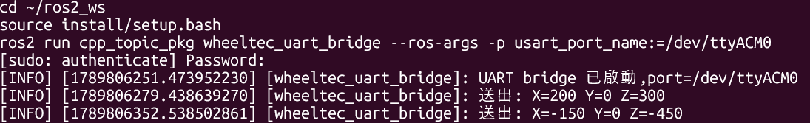
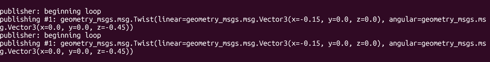
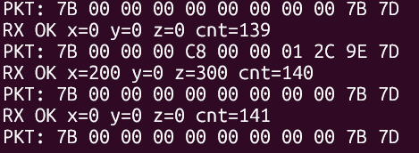
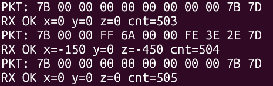

# ROS2 → STM32 UART 轉換節點

將 ROS2 標準速度指令 `/cmd_vel` 轉換為STM32所需的序列埠控制封包，只要發布標準的 `geometry_msgs/msg/Twist` 訊息即可控制車輛。

## 功能

- 訂閱 `/cmd_vel`（`geometry_msgs/msg/Twist`），即時轉換並送出對應的 UART 控制封包
- 依協議規格將 `linear.x` / `linear.y` / `angular.z` 轉換為 mm/s、mm/s、rad/s×1000，並以 `int16_t` Big-Endian打包
- 封包自帶 XOR checksum，符合底盤原廠協議
- **500ms 逾時機制**：超過 0.5 秒沒收到新指令，每 200ms 自動送出一次全零的安全停止封包
- 皆透過同一個 `/cmd_vel` 介面接入

## 範圍

- 本節點**只負責** ROS2 端的封包轉換（`cpp_topic_pkg` 套件、`wheeltec_uart_bridge` 節點）
- **未修改**STM32 韌體
- 待實際接上車輛後，需將 `usart_port_name` 參數指向序列埠（預設 `/dev/wheeltec_controller`，或視情況使用 `/dev/ttyUSB0`）

## 通訊協議

| 項目 | 規格 |
|---|---|
| 串口參數 | 115200 Baud, 8 Data Bits, 1 Stop Bit, No Parity (8N1) |
| 硬體串口 | STM32 底盤預設 USART3 |
| 裝置路徑 | 預設 `/dev/wheeltec_controller`（udev symlink），可用 `usart_port_name` 參數覆寫 |

**下行封包結構（11 bytes）**

| Byte | 內容 | 說明 |
|---|---|---|
| [0] | `0x7B` | 帧頭 |
| [1] | `0x00` | 預留 |
| [2] | `0x00` | 預留 |
| [3] | X MSB | X 軸線速度高位元組（mm/s，Big-Endian） |
| [4] | X LSB | X 軸線速度低位元組 |
| [5] | Y MSB | Y 軸線速度高位元組 |
| [6] | Y LSB | Y 軸線速度低位元組 |
| [7] | Z MSB | Z 軸角速度高位元組（rad/s × 1000） |
| [8] | Z LSB | Z 軸角速度低位元組 |
| [9] | Checksum | 前 9 Bytes XOR 校驗碼 |
| [10] | `0x7D` | 帧尾 |

## 安裝與建置

```bash
cd ~/ros2_ws/src
ros2 pkg create --build-type ament_cmake cpp_topic_pkg --dependencies rclcpp std_msgs
# 加入 geometry_msgs 依賴、放入 src/uart_bridge_node.cpp

cd ~/ros2_ws
colcon build --packages-select cpp_topic_pkg
```

## 執行方式

```bash
source install/setup.bash
ros2 run cpp_topic_pkg wheeltec_uart_bridge --ros-args -p usart_port_name:=/dev/ttyACM0
```

未指定 `usart_port_name` ，使用 `/dev/ttyACM0`；接上實際車輛時請改為對應裝置路徑(此為測試板路徑)。

## 測試方式

由於開發階段沒有實體車輛可用，改以一塊**與車輛無關的 STM32 Nucleo-144 (F429ZI)** 開發板作為臨時接收端：韌體僅解析封包格式（帧頭/帧尾/checksum）並將解碼結果透過序列埠印出。

測試範圍：
- 正值 / 負值指令的打包與解碼正確性（含有號數 / 兩補數表示）
- 逾時停止機制是否正常觸發
- Checksum 計算正確性
- 手動逐位元組核對，確認邏輯無誤

測試環境搭建（含 WSL2 + `usbipd-win` 橋接 USB 裝置）。

### 測試指令

因為 ROS2 節點跑在 WSL2，測試板是 Windows 認到的 USB 裝置，兩者中間用 `usbipd-win` 橋接。

**1. Windows（系統管理員 PowerShell）：把測試板轉給 WSL**

```powershell
usbipd list                        # 找到 ST-Link 的 BUSID
usbipd bind --busid 1-1
usbipd attach --wsl --busid 1-1
```

**2. WSL：確認裝置並編譯套件**

```bash
ls /dev/ttyACM*                    # 確認裝置出現，如 /dev/ttyACM0
sudo chmod 666 /dev/ttyACM0

cd ~/ros2_ws
colcon build --packages-select cpp_topic_pkg
```

**3. 終端機 A — 啟動轉換節點**

```bash
cd ~/ros2_ws
source install/setup.bash
ros2 run cpp_topic_pkg wheeltec_uart_bridge --ros-args -p usart_port_name:=/dev/ttyACM0
```

**4. 終端機 B — 監看測試板回傳的解碼結果**

```bash
stty -F /dev/ttyACM0 115200 raw -echo
cat /dev/ttyACM0
```

**5. 終端機 C — 送出測試指令**

```bash
source /opt/ros/lyrical/setup.bash

# 正值測試
ros2 topic pub /cmd_vel geometry_msgs/msg/Twist "{linear: {x: 0.2}, angular: {z: 0.3}}" --once

# 負值測試
ros2 topic pub /cmd_vel geometry_msgs/msg/Twist "{linear: {x: -0.15}, angular: {z: -0.45}}" --once
```

**6. 測試結束後，Windows（系統管理員 PowerShell）歸還裝置**

```powershell
usbipd detach --busid 1-1
```

### 測試結果

| 測試案例 | 送出 `/cmd_vel` | 原始封包(hex) | 解碼結果 | 結果 |
|---|---|---|---|---|
| 正值 | `linear.x=0.2`, `angular.z=0.3` | `7B 00 00 00 C8 00 00 01 2C 9E 7D` | `RX OK x=200 y=0 z=300` 
| 負值 | `linear.x=-0.15`, `angular.z=-0.45` | `7B 00 00 FF 6A 00 00 FE 3E 2E 7D` | `RX OK x=-150 y=0 z=-450` 
| 逾時安全機制 | 無指令輸入超過 0.5 秒 | `7B 00 00 00 00 00 00 00 00 7B 7D` | 持續收到 `RX OK x=0 y=0 z=0` 
| Checksum 驗證 | （所有測試封包） | 校驗碼需正確才印出 RX OK | 全數正確解析、無漏包 




## 結構

```
cpp_topic_pkg/
├── src/
│   └── uart_bridge_node.cpp   # 轉換節點主程式
├── package.xml
├── CMakeLists.txt
```
